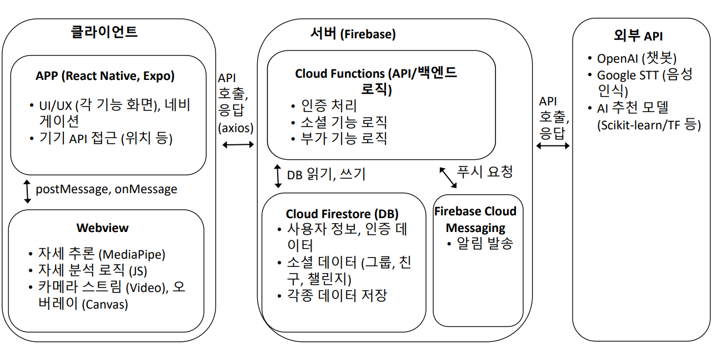

# 캡스톤 디자인 2차 보고서

## Team-Info

| 항목              | 내용                                                                                             |
| :---------------- | :----------------------------------------------------------------------------------------------- |
| (1) 과제명        | *액티브 시니어를 위한 Mediapipe 기반 자세 교정 시각화, 소셜 네트워킹을 중심으로 한 헬스케어 서비스* |
| (2) 팀 번호 / 팀 이름 | 31조-김미니                                                                           |
| (3) 팀 구성원     | 김수연 (2076060) : 리더, 프론트엔드   민다인 (2076131): 팀원, AI   이다건 (2276212) : 팀원, 백엔드 |
| (4) 팀 지도교수   | 심재형 교수님                                                                                  |
| (5) 과제 분류     | 산학과제                                                                                       |
| (6) 과제 키워드   | 액티브 시니어, 헬스케어, *MediaPipe*, 자세 교정, 소셜 네트워킹, *모바일 앱* |
| (7) 과제 내용 요약  | 본 과제는 액티브 시니어를 위한 ~~AR~~ *MediaPipe* 기반 운동 자세 교정 및 ~~AI 맞춤형 운동 추천~~ 기능을 제공하는 헬스케어 플랫폼 개발을 목표로 한다. 사용자가 운동할 때 ~~AR~~ *MediaPipe* 기술을 활용하여 실시간으로 자세를 분석하고 교정할 수 있도록 한다. ~~AI가 건강 상태와 운동 목표를 반영한 맞춤형 운동 루틴을 추천한다.~~ 또한, 운동 지속성을 높이기 위해 가족 및 친구와 함께 운동 챌린지를 수행할 수 있는 소셜 네트워킹 기능을 포함한다. 시니어 친화적인 UI/UX를 적용하여 사용자의 접근성을 높이고, *부가적으로* 음성 명령 및 챗봇 기반 건강 가이드 *등의 편의 기능을* 제공함으로써 사용 편의성을 극대화한다. |

---

## Project-Summary

### (1) 문제 정의

* **Target Customer**: **액티브 시니어(Active Senior)**
    * 액티브 시니어란, 연령대가 높음에도 불구하고 활발한 신체 활동과 사회 참여를 지속하려는 고령층을 의미한다.
    * 이들은 건강 유지와 체력 증진을 위해 운동 및 다양한 활동에 관심이 많으며, 기술을 통해 보다 효과적으로 건강 관리를 하고자 하는 의지를 가진 계층이다. 

* **해결해야 할 문제점 (Pain Points) 및 필요성:** 
    * **1. 운동 자세의 부정확성 및 부상 위험**
        * 액티브 시니어는 연령대에 따른 신체 변화로 인해 올바른 운동 자세를 유지하기 어렵고, 잘못된 자세로 인한 부상 위험이 크다.
        * 기존의 피트니스 앱이나 운동 영상은 *개개인의 실시간 자세를 직접 교정하는 데* 한계가 있어, 개별 사용자가 스스로 판단하기 어렵다. *따라서 객관적이고 즉각적인 개인 맞춤형 자세 교정 피드백 시스템이 필요하다.*
    * **~~2. 개인 맞춤형 운동 정보의 부재~~**
        * ~~일반적인 피트니스 서비스는 주로 젊은 층을 대상으로 한 표준화된 운동 루틴을 제공하므로, 시니어의 체력, 건강 상태, 운동 경험 등을 고려하지 못한다.~~
        * ~~액티브 시니어는 자신의 신체 상태와 건강 목표에 맞는 개인 맞춤형 운동 정보를 필요로 한다.~~ *(부가기능이므로 필요성에서는 생략함)*
    * **~~3~~*2*. 운동 동기 부여의 부족 *및 사회적 고립감***
        * 혼자서 운동을 지속하는 것이 어려워, 중도 포기나 운동 참여율 저하가 발생할 수 있다.
        * 사회적 교류 및 동료와의 경쟁, 협력 시스템이 부족하여 운동 지속성을 확보하기 어렵다. *또한, 시니어의 사회적 고립감 해소를 위한 커뮤니티 활동 지원이 필요하다.*
    * **~~4~~*3*. 디지털 기술 활용의 어려움**
        * 기존 헬스케어 및 피트니스 앱은 복잡한 UI와 작은 글씨, 어려운 조작 방식 등으로 인해 액티브 시니어들이 사용하기에 부담스러운 경우가 많다.
        * *따라서 액티브 시니어 사용자를 위한* 시니어 친화적인 디자인과 음성 명령 *등의* 간단한 조작 방식이 필요하다.

### (2) 기존 연구와의 비교

* **1) 유사 서비스의 장단점**
    * **기존 헬스케어 앱 (예: 삼성 헬스, Apple Fitness, Fitbit)**
        * 장점: 다양한 운동 데이터 기록 및 분석 기능 제공, 대규모 사용자 기반과 연동된 커뮤니티 기능, 체계적인 건강 관리 및 피트니스 목표 설정 도구
        * 단점: 주로 젊은 층을 위한 인터페이스와 기능에 초점, 운동 자세 교정에 대한 피드백이 일반적 영상/텍스트 중심으로, 실시간 개인별 자세 교정 기능 부족, 액티브 시니어의 신체적 특성을 고려한 맞춤형 운동 추천이 미흡
    * **AR/VR 기반 피트니스 솔루션 (예: ~~VR 피트니스 게임~~ *FitXR, Ring Fit Adventure*)**
        * 장점: 몰입감 있는 ~~AR/VR~~ 경험을 통해 운동의 재미와 동기 부여 제공, 실시간 피드백 기능을 통해 운동 수행 시 직관적인 가이드 가능
        * 단점: 주로 게임적 요소에 집중되어 있어 실제 건강 관리나 운동 부상 예방에 필요한 정밀 피드백 부족, 고령 사용자에게는 사용법이 복잡하거나 *고가의* 장비 비용 부담이 큼
    * **시니어 대상 건강 관리 서비스 (예: 일부 공공기관/비영리 건강 프로그램)**
        * 장점: 시니어 맞춤형 정보 제공 및 간단한 운동 프로그램 구성, 저렴하거나 무료로 제공되어 접근성이 높음
        * 단점: 디지털 기술 활용도가 낮아 개인 맞춤형 데이터 분석 및 실시간 피드백 제공 한계, 커뮤니티 기능이나 소셜 네트워킹 요소가 부족해 지속적인 동기 부여에 어려움

* **2) 본 과제가 유사과제에 대하여 갖는 장점**
    * **실시간 ~~AR~~ *MediaPipe* 기반 자세 교정**: 기존 피트니스 앱들은 정적인 영상이나 텍스트 안내에 머무는 반면, 제안된 시스템은 실시간으로 사용자의 운동 자세를 인식하고 교정 피드백을 제공하여 부상 예방과 운동 효과 증대에 직접 기여한다. *, 특히 별도의 고가 장비 없이 스마트폰만으로 구현 가능하다.*
    * **~~개인 맞춤형 AI 운동 추천~~** *(부가 기능이므로 생)*
        * ~~액티브 시니어의 체력과 건강 상태에 따라 맞춤형 운동 루틴을 제안함으로써 기존의 표준화된 운동 프로그램에서 벗어나, 개인의 신체 조건에 최적화된 운동 지도를 제공한다.~~
    * **소셜 네트워킹 및 운동 챌린지**: 단순히 운동 기록을 관리하는 것을 넘어, 친구 및 가족과 함께 운동 그룹을 형성하고 챌린지에 참여할 수 있도록 하여 지속적인 동기 부여와 사회적 상호작용을 유도한다.
    * **시니어 친화적 UI 및 ~~음성 지원~~ *접근성 기능***: 복잡한 인터페이스 대신 큰 글씨, 단순한 버튼, *음성 명령 등* 시니어 사용자들이 쉽게 접근할 수 있는 디자인을 적용, 기존 서비스에서 소홀히 다루는 사용자 경험을 강화한다.

### (3) 제안 내용

본 프로젝트는 시니어층을 위한 ~~AR~~ *MediaPipe* 기반 운동 자세 교정 *시각화* 및 소셜 네트워킹 기능을 갖춘 헬스케어 ~~플랫폼~~ *모바일 애플리케이션*을 제안한다. 기존의 헬스케어 및 피트니스 애플리케이션은 젊은층 위주로 설계되어 있어 시니어들이 사용하기 어렵고, 개별적인 운동 수행 시 올바른 자세 교정이 어려운 문제가 있다. 또한, 운동에 대한 지속적인 동기 부여가 부족하여 중도 포기하는 경우가 많다.

본 프로젝트는 이러한 문제를 해결하기 위해 ~~AR~~ *MediaPipe* 기반 실시간 자세 교정 *시각화* 시스템, ~~AI 운동 분석 및 추천 기능,~~ 소셜 네트워킹을 통한 운동 챌린지 *및 커뮤니티* 시스템을 핵심 솔루션으로 제안한다. *, 이 외 다양한 편의 기능(건강 정보, 알림, 챗봇, 음성 기록 등)을 부가적으로 제공한다.*

### (4) 기대효과 및 의의

* **1) 기대효과**
    * **올바른 운동 자세 교정으로 부상 예방**: ~~AR~~ *실시간* 기반 자세 인식을 통해 사용자가 잘못된 자세를 즉시 수정하여 부상 위험을 낮출 수 있음
    * **~~맞춤형 운동 추천으로 건강 증진~~** *(부가 기능)*: ~~AI가 사용자의 건강 상태를 고려하여 최적의 운동 루틴을 제공, 체력 향상 및 질병 예방 가능~~
    * **소셜 네트워킹을 통한 지속적인 동기 부여**: 운동 챌린지 *및 커뮤니티 활동*을 통해 가족 및 친구와 함께 운동할 수 있어 운동 습관 형성 및 지속성 향상
    * **시니어 친화적 UI 제공으로 접근성 강화**: 음성 명령, ~~TTS 가이드~~, 간편한 UI를 통해 IT 기기에 익숙하지 않은 시니어들도 쉽게 사용할 수 있음 *, 디지털 헬스케어 접근성 향상*
    * ***사회적 연결성 강화**: 커뮤니티 활동을 통해 시니어 사용자의 사회적 고립감 해소 및 유대감 증진*

* **2) 의의**
    * **기술을 활용한 시니어 맞춤형 헬스케어 솔루션 제공**: ~~AR, AI,~~ *MediaPipe*, 소셜 네트워킹 기능을 융합하여 기존에 없던 새로운 개념의 시니어 전용 피트니스 플랫폼 구현
    * **건강한 고령사회 실현에 기여**: 시니어들의 운동 부족 문제를 해결하여 고령층의 건강 증진과 의료비 절감에 기여
    * **운동을 재미있는 경험으로 변화**: 챌린지 및 *커뮤니티* ~~랭킹~~ 시스템을 도입하여 운동을 지루한 것이 아닌 사회적·경쟁적 요소가 포함된 재미있는 활동으로 변화

### (5) 주요 기능 리스트

**핵심 기능 (Main Features)**

1.  **MediaPipe 기반 운동 자세 교정 오버레이 시각화**
    * *설명: 스마트폰 카메라를 통해 실시간으로 사용자의 운동 자세를 인식하고 `MediaPipe Pose` 기술로 분석하여, 스켈레톤, 관절점, 교정 메시지 등을 화면에 오버레이 형태로 시각적 피드백 제공*
    * *핵심 기술: `MediaPipe Pose`, `JavaScript`, `HTML5 Canvas`*
2.  **소셜 네트워킹 기능**
    * **팀 챌린지**: *설명: 사용자가 친구들과 팀을 만들어 공동 운동 목표를 설정하고 함께 도전하며 진행 상황 및 랭킹을 공유하는 기능.*
    * **커뮤니티 게시판**: *설명: 사용자들이 텍스트/이미지 게시물을 작성/공유하고 댓글, '좋아요'로 소통하는 기능.*

**부가 기능 (Additional Features) **

3.  **운동 결과 대시보드**
    * *설명: 자세 교정 운동 결과(시간, 횟수, 정확도 등) 및 기타 운동 기록을 저장하고 시각화된 통계(그래프, 캘린더 등)로 제공.*

4.  **건강 정보 라이브러리**
    * 건강 및 운동 자료: 시니어를 위한 운동법, 안전한 운동법, 영양 정보 등을 제공.
    * 영상 튜토리얼: 운동법을 영상으로 쉽게 이해할 수 있도록 안내.
    * Painpoint: 건강에 관련된 행사나 프로그램이 여러 홈페이지에 나타나 개인이 일일이 챙기기 어렵다.
    * Solution: 크롤링 혹은 관리자의 직접 업데이트로 정부/지자체에서 운영하는 건강 프로그램, 무료 건강검진, 운동 행사 정보를 건강정보라이브러리에 업로드
    * Customer에게 어떤 걸 제공할 수 있는지?(customer view): 정부/지자체에서 운영하는 건강 프로그램, 무료 건강검진, 운동 행사 정보를 한눈에 볼 수 있도록 제공하여 사용자에게 편리함을 제공

5.  **알림 및 리마인더**
    * 개인 맞춤형 알림: 약 복용, 운동 시간 등을 설정하여 알림을 제공합니다.
    * 리마인더 기능: 운동, 약 복용 등 필요한 시간에 맞춰 리마인더 알림 제공.
    * Painpoint : 건강식품 및 약 등 어떤 주기로 얼마나 챙겨 먹어야하는지 일일이 기억하기가 어려움
    * Solution : 약 별로 주기와 복용량에 기반한 알림 및 체크리스트 제공
    * Customer에게 어떤 걸 제공할 수 있는지?(customer view) 건강을 위해 섭취해야하는 약 및 건강식품들을 빠뜨리지 않고 챙길 수 있음.

6.  **챗봇 기반 건강 가이드**
    * 기능: 사용자가 질문하면 운동법, 건강 팁 등을 자동으로 제공하는 챗봇.
    * 사용 기술: 오픈소스 라이브러리(Rasa, Dialogflow 등) 활용.
    * 예시: “걷기 운동 후 스트레칭 방법 알려줘” → 이미지나 텍스트로 답변 제공.
    * Painpoint 갑자기 궁금한 게 생겼을 때 물어볼 곳이 없음
    * Solution: 챗봇을 제공
    * Customer에게 어떤 걸 제공할 수 있는지?(customer view) 굳이 검색엔진을 사용하지 않더라도 접근성 높은 챗봇을 사용하여 쉽게 정보를 얻을 수 있음

7.  **음성 인식 건강 기록**
    * 기능: 사용자가 음성으로 운동 기록을 추가 가능.
    * 기술: Google Speech-to-Text API 활용.
    * 예시: “오늘 30분 걷기 완료”라고 말하면 자동 저장.
    * Painpoint: 타자가 느리고 오타가 많이 나는 시니어들이 다수 존재해 텍스트 입력기반 기록이 힘들수도 있음.
    * Solution: Google Speech-to-Text API 를 활용해서 버튼을 누르면 사용자의 음성을 인식하는 기능을 사용해 더욱더 편하게 건강기록을 할 수 있도록 제공
    * Customer에게 어떤 걸 제공할 수 있는지?(customer view): 타자가 불편한 시니어들은 버튼을 눌러 음성으로 기록을 하면서 기록에 더 편리함을 느낌.

8.  **간단한 AI 운동 추천**
    * 기능: 사용자의 나이, 건강 상태, 목표를 바탕으로 간단한 운동 추천 제공.
    * 기술: Scikit-learn, TensorFlow 등으로 기본적인 추천 모델 구현.
    * 데이터: 정형화된 CSV 데이터로 훈련.
    * Painpoint: 어떤 운동이 나에게 맞을지에 대해 알지 못하고, 정보접근성이 낮음
    * Solution: 맞춤화된 운동데이터를 사용하여 자신의 신체상태에 맞는 운동을 추천
    * Customer에게 어떤 걸 제공할 수 있는지?(customer view): 추가적인 비용 및 전문적 인력없이 어떤 운동을 해야할지 알 수 있게 해줌

9.  **실시간 데이터 시각화 대시보드**
    * 기능: 운동 데이터를 실시간으로 그래프로 시각화하여 보여줌.
    * 기술: Streamlit, Plotly Dash 활용.
    * 예시: 사용자가 걷기 기록을 추가하면 대시보드에 자동으로 업데이트.
    * Painpoint: 사용자가 자신의 운동 기록의 추이를 확인하기 어렵고, 번거로움.
    * Solution: 사용자가 입력한 운동 기록을 업테이트하여 그래프로 시각화함.
    * Customer에게 어떤 걸 제공할 수 있는지?(customer view): 자신의 운동기록을 한눈에 볼 수 있음.

10. **로케이션 기반 활동 추천**
    * 기능: 사용자의 위치를 기반으로 근처 공원, 운동 시설 등을 추천.
    * 기술: Google Maps API 활용.
    * 예시: “가까운 산책로: ○○ 공원 (1.2km 거리)”.
    * Painpoint: 사용자가 근처 운동 시설을 알기 힘듦.
    * Solution: 사용자 위치 정보와 google maps api 기술을 활용하여, 사용자 근처의 운동시설을 추천해주고 관련 정보를 제공함.
    * Customer에게 어떤 걸 제공할 수 있는지?(customer view): 실질적으로 사용자에게 필요한 주변 운동 시설에 대한 정보를 알고, 운동에 활용할 수 있음.

---

## Project-Design & Implementation

### (1) 요구사항 정의

본 프로젝트의 성공적인 완수와 사용자 만족을 위해, 개발될 소프트웨어 시스템이 반드시 갖추어야 할 기능적 요구사항과 시스템의 품질 및 제약 조건에 관한 비기능적 요구사항을 명확히 정의했습니다. 이는 프로젝트의 범위 확정, 설계 및 구현의 기준 설정, 최종 결과물의 검증 지표로 활용됩니다. 요구사항은 사용자인 액티브 시니어의 특성과 프로젝트 목표(자세 교정 통한 부상 예방, 소셜 기능 통한 동기 부여, 사용 편의성)를 최우선으로 고려하여 도출되었습니다.

**1. 기능 요구사항 (Functional Requirements)**

시스템이 사용자에게 제공해야 하는 구체적인 기능들을 정의했습니다. 주요 기능 요구사항은 다음 표와 같으며, **표 아래에 핵심 요구사항(FR-01, FR-02, FR-03)에 대한 부가 설명을 덧붙였습니다.**

| ID    | 기능명                     | 설명                                                                                       | 입력 데이터                         | 출력 데이터                                  | 제약조건/참고                                           |
| :---- | :----------------------- | :--------------------------------------------------------------------------------------- | :---------------------------------- | :------------------------------------------- | :------------------------------------------------------ |
| FR-01 | 실시간 운동 자세 교정 및 시각화 | 사용자의 운동 자세를 실시간으로 분석하여 정확도를 판단하고, 시각적 피드백(스켈레톤, 교정 메시지 등)을 화면에 오버레이하여 제공 | 카메라 영상 스트림, 선택된 운동 정보 | 실시간 스켈레톤/관절 오버레이, 자세 정확도, 교정 메시지 | MediaPipe Pose 활용 (클라이언트 측 처리)                 |
| FR-02 | 팀 챌린지 관리             | 사용자가 친구들과 팀을 구성하여 공동 운동 목표를 설정하고 함께 도전하며 진행 상황을 공유/확인                | 팀 생성 정보, 친구 초대, 운동 기록    | 챌린지 목록, 팀/개인 진행률, 순위 정보, 알림      | Firebase 기반 백엔드 로직 필요                          |
| FR-03 | 커뮤니티 게시판 기능         | 사용자가 텍스트/이미지 게시물을 작성/조회/수정/삭제하고, 댓글/'좋아요'를 통해 상호작용                       | 게시물 내용(텍스트, 이미지), 댓글 내용 | 게시물 목록, 상세 내용, 댓글 목록, '좋아요' 수  | Firebase 기반 백엔드 로직 필요                          |
| FR-04 | 운동 결과 기록 및 조회       | 자세 교정 기능 등으로 수행한 운동 결과를 자동으로 기록하고, 사용자가 누적 기록 및 통계를 조회               | 운동 수행 결과 데이터             | 운동 기록 목록, 통계 데이터, 시각화 그래프        | 결과 저장 위한 백엔드 연동 필요                          |
| FR-05 | 사용자 인증 및 프로필 관리   | 회원가입, 로그인/로그아웃 기능을 제공하고, 사용자가 자신의 프로필(닉네임, 사진 등)을 관리                  | 사용자 계정 정보, 프로필 정보       | 로그인 세션, 사용자 프로필 표시                | Firebase Authentication 활용                          |
| FR-06 | 건강 정보 라이브러리         | 시니어에게 유용한 건강 관련 정보(운동법, 건강 팁 등)를 텍스트, 이미지, 영상 형태로 제공                    | (관리자) 콘텐츠 데이터 입력       | 건강 정보 목록 및 상세 내용                  | 콘텐츠 업데이트 방식 정의 필요(수동/크롤링)               |
| FR-07 | 알림 및 리마인더           | 사용자가 설정한 운동/약 복용 시간 등에 맞춰 푸시 또는 인앱 알림 제공                                       | 알림 설정 정보 (시간, 내용, 반복) | 설정된 시간에 알림 메시지                      | FCM 활용                                                |
| FR-08 | 챗봇 기반 건강 가이드        | 사용자의 간단한 건강 관련 질문에 대해 챗봇이 응답                                                          | 사용자 질문 텍스트                | 챗봇 답변 텍스트                             | OpenAI API 등 외부 AI 연동 필요                         |
| FR-09 | 음성 인식 건강 기록          | 사용자가 음성으로 운동 기록 등을 입력하면 텍스트로 변환하여 저장                                           | 사용자 음성 입력                  | 변환된 텍스트 데이터                         | Google STT API 등 외부 AI 연동 필요                     |
| FR-10 | AI 운동 추천 (간단)        | 사용자의 기본 정보 및 선호도 기반 간단한 운동 루틴 추천                                                    | 사용자 프로필, 선호도 정보        | 추천 운동 목록                               | 추천 알고리즘/모델 구현 필요                             |
| FR-11 | 로케이션 기반 활동 추천      | 사용자 위치 기반 주변 운동 시설(공원, 산책로 등) 정보 제공                                                 | 사용자 현재 위치 정보             | 주변 시설 목록 및 정보                         | Google Maps API 등 외부 지도 API 연동 필요              |

**※ 주요 기능 요구사항 부가 설명:**

* **FR-01 (실시간 운동 자세 교정 및 시각화)에 대한 부가 설명:**
    이 기능은 본 서비스의 핵심 가치 중 하나로, 사용자의 **안전하고 효과적인 운동 수행**을 직접적으로 지원합니다. 시스템은 반드시 스마트폰 카메라만으로 별도의 센서 없이 실시간 처리가 가능해야 하며, 이를 위해 클라이언트 측에서 MediaPipe Pose AI 모델을 효율적으로 구동해야 합니다. 단순한 정확/부정확 판단을 넘어, 사용자가 **어떤 부분을 어떻게 교정해야 하는지 인지**할 수 있도록 스켈레톤 오버레이, 주요 관절 강조, 구체적인 텍스트 피드백(예: "허리를 더 펴세요") 등 **다각적이고 직관적인 시각화** 방법을 제공하는 것이 중요합니다. 또한, 다양한 운동 종류(최소 스쿼트, 런지 등 기본 운동 포함)에 대한 자세 분석 기준 및 피드백 로직이 정의되어야 합니다.
* **FR-02 (팀 챌린지 관리)에 대한 부가 설명:**
    이 기능은 사용자의 **운동 동기 부여 및 지속성 강화**를 목표로 합니다. 단순 경쟁을 넘어 친구들과 함께 **협력하며 공동의 목표를 달성**하는 경험을 제공하는 데 중점을 둡니다. 따라서 팀 생성, 친구 초대, 목표 설정(기간, 운동 종류/횟수/시간 등 다양한 방식 지원 필요), 팀/개인별 진행 상황 실시간 확인, 최종 결과 및 순위 표시 등 챌린지의 전 과정을 지원하는 인터페이스와 백엔드 로직이 필요합니다. 특히, 참여자들의 운동 기록이 챌린지 진행률에 **자동으로 반영**되는 시스템 연동이 중요하며, 적절한 시점의 알림(예: 챌린지 시작/종료, 중간 독려 메시지) 기능은 사용자 참여를 높이는 데 기여할 수 있습니다.
* **FR-03 (커뮤니티 게시판 기능)에 대한 부가 설명:**
    이 기능은 사용자 간의 **사회적 교류를 촉진하고 정보 공유의 장**을 제공함으로써 서비스에 대한 소속감과 만족도를 높이는 것을 목표로 합니다. 사용자는 단순 텍스트뿐 아니라 운동 관련 사진 등을 쉽게 공유할 수 있어야 합니다. 댓글과 '좋아요' 기능은 기본적인 상호작용을 가능하게 하며, 향후 사용자 증가를 고려하여 게시물 검색, 카테고리 분류, 사용자 차단/신고 등 커뮤니티 관리 기능의 확장 가능성도 염두에 두어야 합니다.

**2. 비기능 요구사항 (Non-Functional Requirements)**

시스템의 품질 속성 및 제약 조건에 대한 요구사항을 정의합니다.

* **NFR-01: 사용성 (Usability):** 액티브 시니어 사용자가 **쉽게 학습하고 직관적으로 사용**할 수 있는 UI/UX 제공 (큰 글꼴, 고대비, 간결한 메뉴 구조 등). (지속적 개선 필요)
* **NFR-02: 성능 (Performance):** 실시간 자세 교정 기능의 **지연 없는 반응성** (최소 10fps 이상 처리 권장) 및 앱 전반의 빠른 응답 속도 보장.
* **NFR-03: 정확도 (Accuracy):** 자세 추론 및 분석 결과가 **실제 운동 교정에 유의미**할 정도의 정확성 및 다양한 환경에서의 강인성 확보.
* **NFR-04: 신뢰성/안정성 (Reliability/Stability):** 잦은 오류나 중단 없이 **안정적인 서비스 운영** 및 데이터 동기화 보장.
* **NFR-05: 확장성 (Scalability):** 사용자 및 데이터 증가 시 **성능 저하 없이 서비스**를 제공할 수 있도록 백엔드(Firebase) 설계.
* **NFR-06: 보안 (Security):** 사용자 개인 정보 및 건강 데이터의 **안전한 저장/전송** 및 인가되지 않은 접근 방지 (Firestore 보안 규칙 등 활용).
* **NFR-07: 유지보수성 (Maintainability):** 향후 기능 변경 및 확장이 용이하도록 **모듈화되고 이해하기 쉬운 코드 구조**. 외부 API 변경에 유연한 대응 구조.

**3. 데이터 요구사항 (Data Requirements)**

시스템 운영에 필요한 주요 데이터 엔티티는 다음과 같습니다.

* 사용자 데이터 (계정, 프로필, 설정 등)
* 운동 데이터 (기본 운동 정보, 사용자별 운동 기록 등)
* 소셜 데이터 (친구, 그룹, 챌린지, 게시물, 댓글, 좋아요 등)
* 건강 정보 콘텐츠 데이터
* 알림/리마인더 설정 데이터

### (2) 전체 시스템 구성

본 서비스는 실시간 자세 교정의 클라이언트 측 처리 요구사항과 소셜 네트워킹 및 데이터 관리의 서버 측 요구사항을 효과적으로 만족시키기 위해, **모바일 클라이언트-서버 아키텍처**를 채택하였습니다. 시스템의 전체적인 구조는 아래 설명과 함께 제시될 **시스템 구조도(그림)**에 상세히 표현되어 있으며, 해당 구조를 기반으로 각 구성 요소의 역할과 상호작용, 주요 데이터 흐름을 설명하면 다음과 같습니다.

**1. 주요 구성 요소 및 역할**

* **클라이언트 애플리케이션 (Client Application - `React Native` & `Expo`)**
    * **역할:** 사용자에게 서비스의 모든 기능(자세 교정, 소셜 네트워킹, 부가 기능 등)을 접근할 수 있는 통합 인터페이스(UI/UX)를 제공합니다. 화면 간의 이동(Navigation), 사용자 입력 처리, 기기 자체 자원(카메라, 위치 정보 등) 접근 및 권한 관리, 서버와의 통신을 담당하는 최전선 컴포넌트입니다.
    * **주요 기술:** 크로스 플랫폼 개발을 위해 `React Native` 프레임워크와 `Expo` 플랫폼을 사용하며, 서버와의 HTTP 통신에는 `axios` 라이브러리를 활용합니다.
    * **핵심 기능:** 실시간 자세 교정 기능을 위해 내부에 WebView 컴포넌트를 호스팅하고 관리하며, WebView로부터 자세 분석 결과를 받아 사용자에게 표시하거나 서버에 전송하는 역할을 수행합니다.

* **웹뷰 컴포넌트 (WebView Component)**
    * **역할:** `React Native` 앱 내에서 웹 기술(HTML, CSS, JavaScript)을 실행하는 독립적인 브라우징 환경입니다. 특히, *computationally intensive*한 **실시간 자세 추론(`MediaPipe`) 및 분석, `Canvas` 기반 오버레이 시각화** 작업을 전담하여 `React Native`의 메인 스레드 부하를 줄이고 앱의 반응성을 유지하는 핵심적인 역할을 수행합니다.
    * **주요 기술:** HTML5 `<video>` 태그 (카메라 스트림 처리), `@mediapipe/pose` 라이브러리 (자세 추론), `JavaScript` (분석 로직), HTML5 `<canvas>` API (시각화).
    * **핵심 기능:** 카메라 영상 스트림을 직접 받아 처리하고, 분석된 자세 데이터(관절 좌표, 정확도, 피드백 메시지 등)를 `React Native` 환경과 `postMessage`/`onMessage` 인터페이스를 통해 *비동기적으로* 통신합니다.

* **서버 (Server - `Firebase` Platform)**
    * **역할:** 애플리케이션의 백엔드 인프라 전체를 담당하며, 데이터 영속성, 비즈니스 로직 처리, 사용자 인증, 실시간 알림 등 확장 가능하고 안정적인 서비스 운영의 기반을 제공합니다.
    * **세부 구성 요소:**
        * **Cloud Functions (API 서버 및 백엔드 로직):** `Node.js` 기반의 서버리스 함수를 통해 구현됩니다. 클라이언트 앱으로부터의 API 요청(RESTful API 형태)을 처리하고, 소셜 네트워킹(팀 챌린지 관리, 커뮤니티 로직 등), 사용자 관리, 부가 기능 관련 핵심 비즈니스 로직을 수행합니다. 또한, 필요시 외부 API(`OpenAI`, `Google STT` 등)를 안전하게 호출하는 역할을 담당합니다.
        * **Cloud Firestore (데이터베이스):** NoSQL 방식의 클라우드 데이터베이스로, 사용자 정보, 인증 데이터, 친구/그룹/챌린지 등 소셜 데이터, 운동 기록, 게시물, 건강 정보 등 서비스 운영에 필요한 모든 데이터를 구조화하여 저장 및 관리합니다. 데이터의 실시간 동기화 기능을 제공하며, 보안 규칙을 통해 데이터 접근 제어를 수행합니다.
        * **Firebase Authentication (사용자 인증):** 이메일/비밀번호, 소셜 로그인 등 다양한 방식을 통한 사용자 회원가입 및 로그인 기능을 안전하고 간편하게 구현하도록 지원하며, 인증된 사용자 정보를 기반으로 서비스 접근 권한을 관리합니다.
        * **Firebase Cloud Messaging (FCM - 푸시 알림):** 친구 요청, 챌린지 업데이트, 새 게시물 알림 등 사용자에게 필요한 정보를 적시에 전달하기 위한 푸시 알림 발송 기능을 제공합니다. `Cloud Functions`에서 특정 이벤트 발생 시 `FCM`을 통해 알림을 트리거합니다.

* **외부 API (External APIs)**
    * **역할:** 애플리케이션의 기능을 확장하고 사용자 경험을 풍부하게 만들기 위해 외부 전문 솔루션들을 연동합니다.
    * **종류 및 용도:** `OpenAI` API(챗봇 기반 건강 가이드), `Google STT` API(음성 인식 건강 기록), `AI 추천 모델(Scikit-learn/TF 등)`, `Google Maps` API(로케이션 기반 활동 추천) 등이 활용됩니다.
    * **연동 방식:** 주로 보안 및 관리 효율성을 위해 서버(`Cloud Functions`) 단에서 호출하고, 처리된 결과를 클라이언트 앱에 전달하는 방식으로 연동됩니다.

**2. 주요 제어 및 데이터 흐름**

시스템 구조도에 표현된 화살표는 주요 제어 및 데이터의 흐름을 나타냅니다. 대표적인 시나리오는 다음과 같습니다.

* **실시간 자세 교정 시나리오:**
    1.  사용자가 앱(`React Native`)에서 운동 시작.
    2.  앱이 카메라 접근 권한을 확인하고 WebView 활성화.
    3.  WebView 내 `<video>`가 카메라 스트림 수신.
    4.  `MediaPipe`가 매 프레임 자세 추론 -> `JavaScript` 분석 로직 실행 -> `Canvas`에 결과 시각화.
    5.  WebView가 분석 결과(JSON)를 `postMessage`로 앱에 전송.
    6.  앱(`React Native`)이 `onMessage`로 결과 수신 후 화면 업데이트 및 필요시 `Cloud Functions` API 호출하여 결과 저장 요청.
    7.  `Cloud Functions`가 요청 처리 후 `Firestore`에 운동 결과 저장.

* **팀 챌린지 생성 시나리오:**
    1.  사용자가 앱(`React Native`)에서 팀 챌린지 생성 정보 입력 후 '생성' 버튼 클릭.
    2.  앱이 `axios`를 통해 `Cloud Functions`의 `/createChallenge` API 엔드포인트 호출 (POST 요청, 챌린지 데이터 포함).
    3.  `Cloud Functions` 함수 실행: 요청 데이터 검증 -> `Firestore`의 `challenges` 및 관련 컬렉션에 데이터 저장 -> 성공/실패 응답 반환.
    4.  앱이 응답 수신 후 사용자에게 결과 알림 및 화면 갱신.
    5.  (선택적) `Cloud Functions`가 챌린지 생성 알림을 위해 `FCM` 호출 -> `FCM`이 팀 멤버들에게 푸시 알림 발송.

이러한 시스템 구조는 실시간 처리 성능이 중요한 자세 교정 기능은 클라이언트(특히 WebView)에서 효율적으로 수행하고, 데이터의 일관성과 비즈니스 로직 처리가 중요한 소셜 기능 등은 서버(`Firebase`)에서 안정적으로 관리하도록 역할을 분담함으로써, 전체적으로 **성능, 확장성, 안정성**을 고려한 설계라고 할 수 있습니다. 각 구성 요소는 명확한 역할 분담과 정의된 인터페이스(API, `postMessage`/`onMessage`)를 통해 상호작용합니다.

### (3) 주요 엔진 및 기능 설계

본 애플리케이션의 핵심 사용자 경험을 제공하고 기술적 목표를 달성하기 위해 설계된 주요 소프트웨어 엔진(모듈)은 다음과 같습니다. 여기서는 시스템의 중추를 이루는 **두 가지 핵심 모듈**, 즉 실시간 자세 추론 및 시각화를 담당하는 클라이언트 측 모듈과 소셜 네트워킹 기능의 백엔드를 담당하는 서버 측 모듈의 설계 사상과 상세 구현 방식을 기술했습습니다. 이는 '4-(2) 전체 시스템 구성'에서 제시된 아키텍처를 기반으로 합니다.

**모듈 1: 실시간 자세 추론 및 시각화 엔진 (Real-time Pose Estimation & Visualization Engine)**

* **설계 목표 및 의의:** 사용자가 별도의 센서나 장비 없이 스마트폰 카메라만으로 자신의 운동 자세를 실시간으로 객관적인 피드백과 함께 확인할 수 있도록 하는 것이 목표입니다. 이를 위해 클라이언트 측에서 효율적으로 AI 모델을 구동하고, 분석 결과를 직관적으로 시각화하는 엔진이 필요했습니다. `React Native`의 메인 스레드 부담을 최소화하고 웹 기반 AI 라이브러리(`MediaPipe`) 활용성을 극대화하기 위해 **WebView 컴포넌트 내부에 이 엔진을 구현**하는 아키텍처를 선택했습니다.
* **핵심 기술 스택:** WebView 환경 내 `JavaScript` (ES6+), Google `MediaPipe` (`@mediapipe/pose` 라이브러리), HTML5 `<video>` 및 `<canvas>` API.
* **상세 구현 방식 및 내용**:
    1.  **카메라 스트림 처리:** WebView 내 `<video>` 엘리먼트를 사용하여 `expo-camera` 또는 브라우저의 `getUserMedia` API를 통해 얻어진 실시간 카메라 영상을 입력으로 받습니다. 영상 해상도와 프레임 속도는 기기 성능과 네트워크 환경을 고려하여 적절히 설정합니다.
    2.  **AI 기반 자세 추론 (`MediaPipe Pose` 활용 - AI 인터페이스 상세 기술):**
        * `@mediapipe/pose` `JavaScript` 라이브러리를 사용하여 Google의 사전 훈련된 고성능 포즈 감지 **AI 모델**을 로드하고 초기화합니다. 이 모델은 CNN(Convolutional Neural Network) 기반으로 인체 구조를 학습하여 이미지나 비디오에서 주요 신체 부위를 감지합니다.
        * 매 비디오 프레임마다 `pose.send({image: videoElement})` 메소드를 호출하여 현재 프레임을 모델에 전달하고 *비동기적으로* 자세 추론을 요청합니다.
        * 추론 결과는 `onResults` 콜백 함수를 통해 전달받으며, 이 결과에는 탐지된 인물의 **33개 주요 신체 관절(Landmarks) 각각에 대한 3D 좌표(x, y, z) 및 가시성(`visibility`) 정보**가 포함됩니다. `visibility`는 해당 관절이 이미지 내에서 가려지지 않고 보이는 정도를 나타냅니다. 이 과정은 AI 모델이 사용자의 신체 구조를 이해하고 각 관절의 위치를 정확하게 특정하는 핵심 단계이며, **서버 부담 없이 클라이언트 단에서** 복잡한 자세 분석을 가능하게 합니다.
    3.  **맞춤형 자세 분석 로직:** `MediaPipe`로부터 얻은 33개의 관절 좌표 데이터를 입력으로 받아, 특정 운동 자세(예: 스쿼트 시 무릎 각도, 런지 시 몸통 기울기)의 정확성을 판단하는 `JavaScript` 함수들을 구현합니다. 예를 들어, `getAngle(p1, p2, p3)` 함수는 세 점(관절)의 좌표를 받아 두 벡터(p1->p2, p2->p3)를 정의하고, 이 **벡터들의 내적(dot product)을 이용**하여 사이각을 계산합니다 (theta = arccos( (벡터 A 내적 벡터 B) / (벡터 A 크기 * 벡터 B 크기) )). 이 계산된 각도 값과 사전에 정의된 해당 운동의 **정상 각도 범위(threshold)를 비교**하여 자세의 정확도를 평가하고, "GOOD", "BAD", "무릎 각도가 너무 큽니다" 등 구체적인 피드백 메시지를 결정하는 로직을 수행합니다.
    4.  **`Canvas` 기반 시각화:** HTML5 `<canvas>` API를 활용하여 실시간 카메라 영상 위에 분석 결과를 시각적으로 렌더링합니다.
        * 매 프레임 `canvas`를 `clearRect()`로 지운 후, 현재 비디오 프레임을 `drawImage()`로 배경에 그립니다.
        * `results.poseLandmarks` 좌표를 `canvas` 좌표계로 변환하여 각 관절 위치에 작은 원(`arc()`, `fill()`)을 그리고, 관절들을 선(`lineTo()`, `stroke()`)으로 연결하여 사용자의 스켈레톤을 시각화합니다. 관절의 `visibility` 값에 따라 선이나 원의 투명도(alpha)를 조절하여 가려진 부분을 표현할 수 있습니다.
        * 자세 분석 결과에 따라 특정 관절 부위(예: 각도가 잘못된 무릎)를 다른 색상으로 강조하거나, 결정된 피드백 텍스트(`fillText()`)를 화면 상단 또는 특정 위치에 표시합니다. 이 시각화는 사용자에게 즉각적이고 직관적인 피드백을 제공하여 자세 교정을 용이하게 합니다.
    5.  **결과 데이터 처리 및 통신:** 운동 세션 동안 수집된 데이터(예: 운동 시간, 반복 횟수, 자세 정확도 점수 등)를 집계하여 JSON 객체 형태로 가공합니다. 운동 종료 또는 특정 시점에 `window.ReactNativeWebView.postMessage(JSON.stringify(resultData))`를 호출하여, 가공된 결과 데이터를 ***비동기적으로*** `React Native` 앱 환경으로 전송합니다. 이를 통해 WebView의 처리 결과를 네이티브 앱에서 활용(예: 화면 표시, 서버 전송)할 수 있습니다.
* **고려사항 및 연관 이슈:** 다양한 조명, 촬영 각도, 사용자 의상 등 환경 변화에 강인한 자세 추론 정확도를 확보하는 것이 중요합니다. 또한, 실시간 처리를 위해 WebView 내 `JavaScript` 연산 및 `Canvas` 렌더링 성능 최적화(예: 불필요한 계산/드로잉 최소화)가 필수적입니다.

**모듈 2: 서버리스 백엔드 엔진 (Serverless Backend Engine - `Firebase` 기반)**

* **설계 목표 및 의의:** 사용자 인증, 소셜 네트워킹 기능(팀 챌린지, 커뮤니티), 데이터 저장 및 관리, 푸시 알림 등 서버 측 기능을 안정적이고 확장 가능하게 제공하는 것이 목표입니다. 개발 및 운영 효율성, 초기 비용 절감, 자동 확장성 등을 고려하여 **`Firebase` 플랫폼 기반의 서버리스(Serverless) 아키텍처**를 채택했습니다. 이를 통해 인프라 관리 부담 없이 핵심 비즈니스 로직 개발에 집중할 수 있습니다.
* **핵심 기술 스택:** `Firebase Authentication`, `Firebase Cloud Functions` (`Node.js` 런타임, `firebase-functions` 및 `firebase-admin` SDK), `Firebase Firestore` (NoSQL DB), `Firebase Cloud Messaging` (FCM).
* **상세 구현 방식 및 내용**:
    1.  **사용자 인증 관리 (`Firebase Authentication`):**
        * 이메일/비밀번호 기반 회원가입 및 로그인 기능을 기본으로 제공하며, 필요시 Google, Facebook 등 소셜 로그인 연동 확장이 용이합니다.
        * 사용자 가입 시 고유한 UID(User ID)가 생성되며, 이 UID는 `Firestore` 등 다른 Firebase 서비스에서 사용자를 식별하는 키로 사용됩니다.
        * 클라이언트 SDK 및 Admin SDK를 통해 사용자 세션 관리, 비밀번호 재설정 등 부가 기능을 지원합니다.
    2.  **API 엔드포인트 및 비즈니스 로직 (`Firebase Cloud Functions`):**
        * `firebase-functions` SDK를 사용하여 HTTP 요청(주로 `https://REGION-PROJECT_ID.cloudfunctions.net/FUNCTION_NAME` 형태의 엔드포인트)을 처리하는 함수들을 개발합니다. 클라이언트(`React Native` 앱)는 `axios` 등을 이용해 이 엔드포인트로 요청을 보냅니다.
        * 각 함수는 특정 기능(예: `createTeamChallenge`, `postToCommunity`, `updateUserProfile`)에 대한 비즈니스 로직을 수행합니다. 입력 값 검증, `Firestore` 데이터 읽기/쓰기/수정, 외부 API 호출, 응답 생성 등의 작업을 처리합니다.
        * 예를 들어, `createTeamChallenge` 함수는 요청 본문(request body)으로 받은 챌린지 정보(목표, 기간, 참여자 UID 목록 등)를 검증한 후, `firebase-admin` SDK를 사용하여 `Firestore`의 `challenges` 컬렉션에 새로운 문서를 생성하고 초기 데이터를 기록합니다. 성공 시 생성된 챌린지 ID 등을 포함한 응답을 반환합니다.
    3.  **데이터 영속성 및 관리 (`Firebase Firestore`):**
        * NoSQL 데이터베이스인 `Firestore`를 사용하여 서비스의 모든 데이터를 저장하고 관리합니다. 사용자 프로필, 친구 목록, 그룹 정보, 챌린지 데이터, 커뮤니티 게시물 및 댓글, 운동 기록 등을 **컬렉션(Collection)과 문서(Document) 구조**로 모델링합니다. 예를 들어, `users/{userId}`, `challenges/{challengeId}`, `posts/{postId}` 와 같은 계층적 구조를 사용합니다.
        * 데이터 모델 설계 시, 데이터 조회 효율성과 확장성을 고려합니다. 예를 들어, 챌린지 참여자 목록은 배열로 저장할 수도 있고, 별도의 하위 컬렉션(`challenges/{challengeId}/participants/{userId}`)으로 관리할 수도 있습니다. **읽기/쓰기 비용과 쿼리 복잡도를 고려하여 최적의 구조를 선택**합니다.
        * **`Firestore` 보안 규칙**을 상세하게 설정하여, 인증된 사용자만 자신의 데이터에 접근하거나(예: 자신의 프로필 수정), 허용된 조건 하에서만 특정 데이터(예: 친구의 공개 프로필, 참여 중인 챌린지 정보)를 읽거나 쓸 수 있도록 제어합니다. 이는 데이터 보안의 핵심 요소입니다.
    4.  **실시간 알림 (`Firebase Cloud Messaging` - FCM):**
        * `Cloud Functions` 내에서 특정 이벤트(예: 새 친구 요청, 챌린지 목표 달성 임박, 새 댓글 작성)가 발생했을 때, 해당 사용자 또는 사용자 그룹에게 푸시 알림을 보내야 하는 경우 `firebase-admin` SDK의 `messaging()` API를 사용하여 `FCM` 메시지 전송을 요청합니다. 메시지에는 알림 제목, 내용, 그리고 앱이 특정 화면으로 이동하도록 유도하는 추가 데이터(payload)를 포함할 수 있습니다.
* **고려사항 및 연관 이슈:** 사용자 증가에 따른 `Firestore` 읽기/쓰기 비용 및 `Cloud Functions` 실행 시간/비용 최적화가 필요합니다. 또한, 다수의 `Cloud Functions` 간의 의존성 관리 및 배포 전략, `Firestore` 데이터 모델 변경에 따른 마이그레이션 계획 등이 고려되어야 합니다.

이 두 엔진은 각각 클라이언트 측 실시간 AI 처리와 서버 측 데이터 및 로직 처리를 담당하며, 정의된 인터페이스를 통해 유기적으로 상호작용함으로써 본 서비스의 핵심 기능을 안정적이고 효율적으로 제공합니다.

### (4) 주요 기능의 구현

'Project-Summary'의 '(5) 주요 기능 리스트'에서 정의한 핵심 기능들 중, 평가 기준에 따라 **두 가지 주요 기능**의 상세 구현 과정과 이 과정에서 '4-(3) 주요 엔진 및 기능 설계'에서 설명한 소프트웨어 모듈들이 어떻게 활용되고 연관되는지를 구체적으로 기술했습니다.

**기능 1: MediaPipe 기반 운동 자세 교정 오버레이 시각화 기능 구현**

* **기능 목표**: 사용자가 선택한 운동을 수행하는 동안 실시간으로 자세를 분석하고, 객관적인 시각적 피드백(스켈레톤 오버레이, 교정 메시지 등)을 제공하여 사용자가 스스로 올바른 자세를 인지하고 교정하도록 돕습니다.
* **사용자 시나리오 (User Flow)**:
    1.  사용자는 앱 내 운동 목록에서 수행할 운동(예: 스쿼트)을 선택합니다.
    2.  '운동 시작' 버튼을 누르면 자세 교정 화면으로 전환됩니다. 화면에는 전면 카메라 영상이 표시되고, 운동 관련 정보(예: 목표 횟수, 경과 시간)와 자세 피드백 영역이 나타납니다.
    3.  사용자는 화면 가이드에 맞춰 운동을 시작합니다.
    4.  운동 중 실시간으로 화면 위 카메라 영상에 자신의 스켈레톤과 관절 위치가 오버레이되고, 자세 정확도에 따른 피드백 메시지("좋은 자세", "무릎을 더 굽히세요" 등)가 표시됩니다.
    5.  운동이 종료되면 수행 결과(총 운동 시간, 횟수, 평균 정확도 등)가 요약되어 제시됩니다.
* **상세 구현 과정 및 모듈 연관성**:
    1.  **화면 구성 및 제어 (클라이언트 UI/UX 모듈 - `React Native`)**: 운동 목록 화면 구성 및 네비게이션, 자세 교정 화면 레이아웃(카메라 뷰 영역, 정보 표시 영역, 버튼 등) 구현을 담당합니다. 사용자의 운동 선택 이벤트를 처리하고, 운동 시작 시 WebView 컴포넌트를 초기화하고 화면에 렌더링합니다. 운동 중 WebView로부터 전달받는 실시간 피드백 메시지나 운동 결과 데이터를 화면의 해당 영역에 업데이트하는 로직을 포함합니다.
    2.  **실시간 자세 처리 (자세 추론 및 시각화 엔진 - WebView)**:
        * `React Native` 앱에 의해 활성화된 WebView 컴포넌트는 **'4-(3)-모듈1'에서 상세히 설명된 프로세스**를 수행합니다. 즉, `<video>` 엘리먼트로 카메라 스트림을 받아 `@mediapipe/pose` 라이브러리로 실시간 관절 좌표를 추론합니다.
        * 추론된 좌표를 바탕으로 내장된 `JavaScript` 기반 **자세 분석 로직**이 운동 종류에 따른 정확도를 판단하고 피드백 메시지를 생성합니다.
        * `<canvas>` API를 사용하여 카메라 영상 위에 **스켈레톤, 관절점, 피드백 텍스트 등을 실시간으로 렌더링(오버레이 시각화)**합니다. 이 모든 과정은 WebView 내부에서 이루어지며, 이를 통해 `React Native` 메인 스레드의 부담을 줄여 앱 반응성을 유지합니다.
    3.  **WebView-앱 간 통신 (인터페이스)**: WebView 내에서 자세 분석 결과(실시간 피드백 메시지, 횟수 카운트)나 최종 운동 결과(총 시간, 평균 정확도 등)가 집계되면, `window.ReactNativeWebView.postMessage()` 함수를 사용하여 이 데이터를 JSON 문자열 형태로 `React Native` 앱 환경으로 ***비동기적으로*** 전달합니다.
    4.  **결과 처리 및 저장 (클라이언트 앱 모듈 & 백엔드 연동)**: `React Native` 앱은 WebView로부터 `onMessage` 이벤트 핸들러를 통해 메시지를 수신하고 파싱합니다. 수신된 데이터를 바탕으로 화면의 운동 정보(횟수, 메시지 등)를 업데이트합니다. 운동 세션 종료 시 최종 결과 데이터를 요약하여 사용자에게 보여주고, 필요시 이 결과를 서버에 영구적으로 저장하기 위해 **백엔드 API(`Cloud Functions` - '4-(3)-모듈2'의 일부)를 호출**합니다.
* **핵심 연관 모듈**: 이 기능은 사용자의 상호작용을 처리하는 **클라이언트 UI/UX 모듈(`React Native`)**과 실제 AI 분석 및 시각화를 담당하는 **자세 추론 및 시각화 엔진(WebView 기반, 4-(3)-모듈1)**이 `postMessage`/`onMessage` 인터페이스를 통해 긴밀하게 상호작용하며 구현됩니다. 최종 결과 저장을 위해서는 **서버리스 백엔드 엔진(`Firebase`, 4-(3)-모듈2)**과의 연동이 필요합니다.

**기능 2: 소셜 네트워킹 - 팀 챌린지 기능 구현**

* **기능 목표**: 사용자들이 친구들과 함께 공동의 운동 목표를 설정하고 달성 과정을 공유함으로써 운동에 대한 동기를 부여하고 사회적 유대감을 형성하도록 지원합니다.
* **사용자 시나리오 (User Flow)**:
    1.  사용자는 앱 내 소셜 탭에서 '팀 챌린지' 섹션으로 이동합니다.
    2.  기존에 참여 중인 챌린지 목록을 확인하거나, '새 챌린지 만들기' 버튼을 누릅니다.
    3.  챌린지 생성 시, 챌린지 이름, 목표(예: '일주일간 스쿼트 100회 하기'), 기간 등을 설정하고 함께할 친구를 초대합니다.
    4.  챌린지가 시작되면, 참여자들은 자신의 운동 기록(자세 교정 기능 등을 통해 기록된)을 바탕으로 챌린지 목표 달성에 기여합니다.
    5.  사용자는 챌린지 상세 화면에서 팀 전체의 진행률, 팀 내 순위, 친구들의 활동 내역 등을 확인할 수 있습니다.
    6.  챌린지 기간 종료 시 최종 결과 및 순위가 표시됩니다.
* **상세 구현 과정 및 모듈 연관성**:
    1.  **화면 구성 및 사용자 입력 (클라이언트 UI/UX 모듈 - `React Native`)**: 팀 챌린지 목록, 챌린지 상세 정보, 챌린지 생성/편집, 친구 초대 등 다양한 화면과 관련 UI 컴포넌트(리스트, 버튼, 입력 폼, 프로그레스 바 등)를 구현합니다. 사용자의 입력(챌린지 설정값, 친구 선택 등)을 받아 상태(state)로 관리합니다.
    2.  **클라이언트-서버 통신 (클라이언트 앱 모듈 & 백엔드 API)**: 사용자가 챌린지 생성, 참여, 진행 상황 조회 등 특정 액션을 취하면, 클라이언트 앱은 해당 요청에 필요한 데이터를 포함하여 **백엔드 API(`Cloud Functions` - '4-(3)-모듈2'의 일부)**의 특정 엔드포인트(예: `/createChallenge`, `/getChallengeDetails`)를 `axios` 라이브러리를 사용하여 호출합니다. HTTP POST 요청으로 필요한 데이터를 전송합니다.
    3.  **서버 측 로직 처리 (서버리스 백엔드 엔진 - `Cloud Functions`)**:
        * 요청을 받은 `Cloud Function`은 먼저 요청의 유효성(입력값 검증, 사용자 인증 상태 확인 등)을 검사합니다.
        * 핵심 비즈니스 로직을 수행합니다. 예를 들어 `/createChallenge` 함수는 `Firestore`에 새로운 챌린지 문서를 생성하고 참여자 정보를 기록합니다. `/updateChallengeProgress` 함수(자세 교정 결과 저장 API와 연동될 수 있음)는 특정 사용자의 운동 기록을 받아 해당 챌린지의 진행 상태를 업데이트하고 팀 전체 진행률을 다시 계산합니다.
        * 모든 로직 처리는 **`Firestore` 데이터베이스('4-(3)-모듈2'의 일부)**와의 상호작용(데이터 읽기/쓰기)을 포함하며, `firebase-admin` SDK를 사용합니다.
        * 처리 결과를 클라이언트 앱에 JSON 형태로 응답합니다.
    4.  **데이터 저장 및 관리 (서버리스 백엔드 엔진 - `Firestore`)**: 챌린지 자체의 정보(ID, 이름, 목표, 기간, 생성자 등), 참여자 목록 및 역할, 참여자별/팀별 진행 상황 데이터 등이 `Firestore`에 설계된 데이터 모델(예: `challenges` 컬렉션, 관련 하위 컬렉션)에 따라 저장되고 관리됩니다. 데이터 조회를 통해 챌린지 목록, 상세 정보, 랭킹 등을 클라이언트에 제공합니다.
    5.  **결과 표시 및 실시간 업데이트 (클라이언트 앱 모듈 & `FCM`)**: 클라이언트 앱은 백엔드 API로부터 받은 응답 데이터를 사용하여 챌린지 목록, 진행률 바, 순위 등의 UI를 업데이트합니다. `Firestore`의 실시간 리스너 기능을 활용하거나, 또는 백엔드(`Cloud Functions`)에서 특정 이벤트 발생 시 **`FCM`('4-(3)-모듈2'의 일부)**을 통해 푸시 알림(예: 친구의 챌린지 초대, 순위 변동)을 보내 클라이언트 앱이 이를 수신하여 사용자에게 알리고 관련 UI를 즉시 갱신할 수 있습니다.
* **핵심 연관 모듈**: 이 기능은 사용자 인터페이스를 담당하는 **클라이언트 UI/UX 모듈(`React Native`)**과 실제 로직 처리 및 데이터 관리를 수행하는 **서버리스 백엔드 엔진(Firebase 기반, 4-(3)-모듈2)**이 API 통신을 통해 핵심적인 상호작용을 하며 구현됩니다. 실시간 알림을 위해서는 **`FCM`**과의 연동이 중요합니다.

**부가 기능 구현**

3.  **건강 정보 라이브러리**
    * 건강 및 운동 자료: 시니어를 위한 운동법, 안전한 운동법, 영양 정보 등을 제공.
    * 영상 튜토리얼: 운동법을 영상으로 쉽게 이해할 수 있도록 안내.
    * Painpoint: 건강에 관련된 행사나 프로그램이 여러 홈페이지에 나타나 개인이 일일이 챙기기 어렵다.
    * Solution: 크롤링 혹은 관리자의 직접 업데이트로 정부/지자체에서 운영하는 건강 프로그램, 무료 건강검진, 운동 행사 정보를 건강정보라이브러리에 업로드
    * Customer에게 어떤 걸 제공할 수 있는지?(customer view): 정부/지자체에서 운영하는 건강 프로그램, 무료 건강검진, 운동 행사 정보를 한눈에 볼 수 있도록 제공하여 사용자에게 편리함을 제공

4.  **알림 및 리마인더**
    * 개인 맞춤형 알림: 약 복용, 운동 시간 등을 설정하여 알림을 제공합니다.
    * 리마인더 기능: 운동, 약 복용 등 필요한 시간에 맞춰 리마인더 알림 제공.
    * Painpoint : 건강식품 및 약 등 어떤 주기로 얼마나 챙겨 먹어야하는지 일일이 기억하기가 어려움
    * Solution : 약 별로 주기와 복용량에 기반한 알림 및 체크리스트 제공
    * Customer에게 어떤 걸 제공할 수 있는지?(customer view) 건강을 위해 섭취해야하는 약 및 건강식품들을 빠뜨리지 않고 챙길 수 있음.

5.  **챗봇 기반 건강 가이드**
    * 기능: 사용자가 질문하면 운동법, 건강 팁 등을 자동으로 제공하는 챗봇.
    * 사용 기술: 오픈소스 라이브러리(Rasa, Dialogflow 등) 활용.
    * 예시: “걷기 운동 후 스트레칭 방법 알려줘” → 이미지나 텍스트로 답변 제공.
    * Painpoint 갑자기 궁금한 게 생겼을 때 물어볼 곳이 없음
    * Solution: 챗봇을 제공
    * Customer에게 어떤 걸 제공할 수 있는지?(customer view) 굳이 검색엔진을 사용하지 않더라도 접근성 높은 챗봇을 사용하여 쉽게 정보를 얻을 수 있음

6.  **음성 인식 건강 기록**
    * 기능: 사용자가 음성으로 운동 기록을 추가 가능.
    * 기술: `Google Speech-to-Text API` 활용.
    * 예시: “오늘 30분 걷기 완료”라고 말하면 자동 저장.
    * Painpoint: 타자가 느리고 오타가 많이 나는 시니어들이 다수 존재해 텍스트 입력기반 기록이 힘들수도 있음.
    * Solution: `Google Speech-to-Text API` 를 활용해서 버튼을 누르면 사용자의 음성을 인식하는 기능을 사용해 더욱더 편하게 건강기록을 할 수 있도록 제공
    * Customer에게 어떤 걸 제공할 수 있는지?(customer view): 타자가 불편한 시니어들은 버튼을 눌러 음성으로 기록을 하면서 기록에 더 편리함을 느낌.

7.  **간단한 AI 운동 추천**
    * 기능: 사용자의 나이, 건강 상태, 목표를 바탕으로 간단한 운동 추천 제공.
    * 기술: `Scikit-learn`, `TensorFlow` 등으로 기본적인 추천 모델 구현.
    * 데이터: 정형화된 CSV 데이터로 훈련.
    * Painpoint: 어떤 운동이 나에게 맞을지에 대해 알지 못하고, 정보접근성이 낮음
    * Solution: 맞춤화된 운동데이터를 사용하여 자신의 신체상태에 맞는 운동을 추천
    * Customer에게 어떤 걸 제공할 수 있는지?(customer view): 추가적인 비용 및 전문적 인력없이 어떤 운동을 해야할지 알 수 있게 해줌

8.  **실시간 데이터 시각화 대시보드**
    * 기능: 운동 데이터를 실시간으로 그래프로 시각화하여 보여줌.
    * 기술: `Streamlit`, `Plotly Dash` 활용.
    * 예시: 사용자가 걷기 기록을 추가하면 대시보드에 자동으로 업데이트.
    * Painpoint: 사용자가 자신의 운동 기록의 추이를 확인하기 어렵고, 번거로움.
    * Solution: 사용자가 입력한 운동 기록을 업테이트하여 그래프로 시각화함.
    * Customer에게 어떤 걸 제공할 수 있는지?(customer view): 자신의 운동기록을 한눈에 볼 수 있음.

9.  **로케이션 기반 활동 추천**
    * 기능: 사용자의 위치를 기반으로 근처 공원, 운동 시설 등을 추천.
    * 기술: `Google Maps API` 활용.
    * 예시: “가까운 산책로: ○○ 공원 (1.2km 거리)”.
    * Painpoint: 사용자가 근처 운동 시설을 알기 힘듦.
    * Solution: 사용자 위치 정보와 `google maps api` 기술을 활용하여, 사용자 근처의 운동시설을 추천해주고 관련 정보를 제공함.
    * Customer에게 어떤 걸 제공할 수 있는지?(customer view): 실질적으로 사용자에게 필요한 주변 운동 시설에 대한 정보를 알고, 운동에 활용할 수 있음.

### (5) 기타

* **현재 구현 상태**:
    * **플랫폼**: `React Native` 기반의 모바일 애플리케이션 기본 구조 개발 완료.
    * **핵심 기능 구현**: 실시간 자세 교정 시각화(`MediaPipe` 연동 및 `Canvas` 오버레이), 운동 결과 대시보드 표시, 기본 소셜 기능(커뮤니티 게시판 구조, 팀 챌린지 기본 로직) 구현 완료.
    * **부가 기능 부분 구현**: 건강 정보 라이브러리 콘텐츠 일부 탑재, 알림/리마인더 기본 기능 구현 완료.
    * **외부 연동**: `Google Speech-to-Text` API 연동 준비 완료 (실제 기능 통합 및 테스트 필요). 챗봇(`OpenAI`), AI 운동 추천, 로케이션 기반 추천 기능은 현재 미구현 또는 초기 설계 단계.
    * **검증**: 구현된 핵심 기능들에 대한 초기 단위 테스트 및 통합 테스트 완료.
* **미진한 내용 및 향후 계획 (100% 완료되지 않은 내용 기술)**:
    현재 프로젝트 완료율은 약 60~70% 수준으로 추산되며, 최종 완료를 위해 다음과 같은 미진한 부분에 대한 추가 개발 및 개선이 필요합니다.
    1.  **기능 구현 완료**: 미구현된 부가 기능(챗봇 기반 건강 가이드, AI 운동 추천, 로케이션 기반 활동 추천)의 개발 및 `Google STT` 기능의 완전한 통합이 필요합니다.
    2.  **기능 고도화**: 구현된 핵심 기능(자세 교정, 소셜 네트워킹)의 안정성을 높이고 사용자 피드백을 반영하여 기능을 고도화해야 합니다. 특히, 자세 교정의 정확도 향상 및 지원 운동 종류 확대, 팀 챌린지의 랭킹 시스템 및 알림 기능 상세 구현, 커뮤니티 관리 기능 추가 등이 필요합니다.
    3.  **성능 및 안정성 개선**: 자세 교정 기능의 실시간 처리 성능 최적화(프레임 드랍 최소화), 백엔드 부하 관리 및 안정성 확보(사용자 증가 대비), 네트워크 환경 변화에 따른 대응 등 전반적인 성능 및 안정성 개선 작업이 요구됩니다.
    4.  **사용성 검증 및 개선**: 시니어 사용자를 대상으로 한 심층 사용성 테스트(Usability Test)를 수행하고, 그 결과를 바탕으로 UI/UX를 개선하여 실제 사용 편의성을 극대화해야 합니다.
    5.  **API 관리 및 비용 최적화**: 외부 API(`OpenAI`, `Google STT`, `Google Maps` 등) 사용량 증가에 따른 비용 발생을 모니터링하고 최적화 방안을 마련해야 합니다. API 키 관리 및 보안 강화도 필요합니다.
    6.  **데이터셋 추가**: 현재 운동 자세에 대한 기준은 자세 분석 로직에 하드코딩되어 있습니다. 이는 저희가 수집한 정보를 바탕으로 정의한 운동별 핵심 관절의 올바른 각도 범위입니다. 이를 추후 공개된 데이터셋 사이트(ex. AI Hub, 공공데이터 포털)에서 데이터를 찾아 사용하거나 트레이너의 영상에서 데이터를 추출하는 방식으로 수정하는 것을 고려하고 있습니다.
* **AI 관련 인터페이스 사용 요약**:
    * **`MediaPipe Pose`**: 핵심 기능인 실시간 자세 추론 및 분석에 사용되었으며, 상세 구현 방식은 '4-(3)-모듈1'에 충분히 기술되었습니다.
    * **`Google Speech-to-Text`**: 음성 인식 건강 기록 기능 구현을 위해 연동 준비 중이며, `Cloud Functions` 또는 클라이언트에서 API를 호출하여 음성을 텍스트로 변환하는 방식으로 구현될 예정입니다.
    * **`OpenAI (GPT)`**: 챗봇 기반 건강 가이드 기능 구현에 사용될 예정이며, `Cloud Functions`에서 API를 호출하여 답변을 생성하는 방식으로 구현될 예정입니다.
    * **(Potential) `Scikit-learn`/`TensorFlow`**: 간단한 AI 운동 추천 기능 구현에 사용될 수 있으며, 모델 학습 및 서빙 방식은 추후 구체화될 예정입니다.

---
