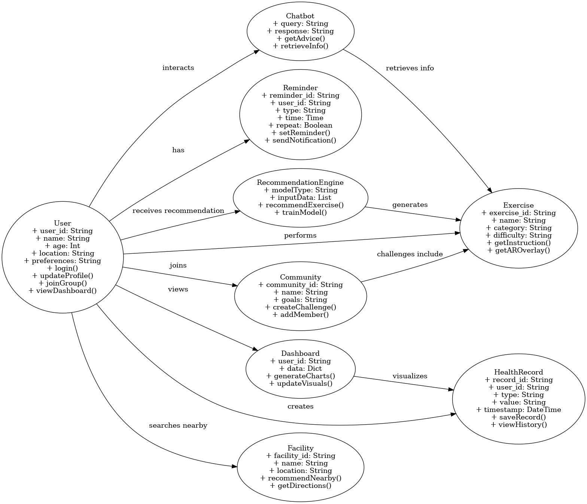

# Team-Info
| (1) 과제명 | *액티브 시니어를 위한 AR 기술을 사용해 개인맞춤화가 가능한 자세교정 기반 시니어 소통 서비스*
|:---  |---  |
| (2) 팀 번호 / 팀 이름 | 31조-김미니 |
| (3) 팀 구성원 | 김수연 (2076060) : 리더, 프론트엔드   민다인 (2076131): 팀원, AI   이다건 (2276212) : 팀원, 백엔드|
| (4) 팀 지도교수 | 심재형 교수님 |
| (5) 과제 분류 | 산학과제 |
| (6) 과제 키워드 | 액티브 시니어, 헬스케어, AR 운동 자세 가이드, 소셜 네트워킹 |
| (7) 과제 내용 요약 | 본 과제는 액티브 시니어를 위한 AR 기반 운동 자세 교정 및 AI 맞춤형 운동 추천 기능을 제공하는 헬스케어 플랫폼 개발을 목표로 한다. 사용자가 운동할 때 AR 기술을 활용하여 실시간으로 자세를 분석하고 교정할 수 있도록 하며, AI가 건강 상태와 운동 목표를 반영한 맞춤형 운동 루틴을 추천한다. 또한, 운동 지속성을 높이기 위해 가족 및 친구와 함께 운동 챌린지를 수행할 수 있는 소셜 네트워킹 기능을 포함한다. 시니어 친화적인 UI/UX를 적용하여 사용자의 접근성을 높이고, 음성 명령 및 챗봇 기반 건강 가이드를 제공함으로써 사용 편의성을 극대화한다.|

 

# Project-Summary

---

## (1) 문제 정의
본 과제는 액티브 시니어를 대상으로 하며, 이들이 직면한 운동 및 건강 관리상의 문제들을 해결하거나 완화하는 것을 목표로 한다.

### 1) Target Customer: 액티브 시니어
   - 액티브 시니어란, 연령대가 높음에도 불구하고 활발한 신체 활동과 사회 참여를 지속하려는 고령층을 의미한다.
   - 이들은 건강 유지와 체력 증진을 위해 운동 및 다양한 활동에 관심이 많으며, 기술을 통해 보다 효과적으로 건강 관리를 하고자 하는 의지를 가진 계층이다.

### 2) 해결해야 할 문제점 (Pain Points)
#### 1. 운동 자세의 부정확성 및 부상 위험
   - 액티브 시니어는 연령대에 따른 신체 변화로 인해 올바른 운동 자세를 유지하기 어렵고, 잘못된 자세로 인한 부상 위험이 크다.
   - 기존의 피트니스 앱이나 운동 영상은 자세 교정에 한계가 있어, 개별 사용자가 스스로 판단하기 어렵다.

#### 2. 개인 맞춤형 운동 정보의 부재
   - 일반적인 피트니스 서비스는 주로 젊은 층을 대상으로 한 표준화된 운동 루틴을 제공하므로, 시니어의 체력, 건강 상태, 운동 경험 등을 고려하지 못한다.
   - 액티브 시니어는 자신의 신체 상태와 건강 목표에 맞는 개인 맞춤형 운동 정보를 필요로 한다.

#### 3. 운동 동기 부여의 부족
   - 혼자서 운동을 지속하는 것이 어려워, 중도 포기나 운동 참여율 저하가 발생할 수 있다.
   - 사회적 교류 및 동료와의 경쟁, 협력 시스템이 부족하여 운동 지속성을 확보하기 어렵다.

#### 4. 디지털 기술 활용의 어려움
   - 기존 헬스케어 및 피트니스 앱은 복잡한 UI와 작은 글씨, 어려운 조작 방식 등으로 인해 액티브 시니어들이 사용하기에 부담스러운 경우가 많다.
   - 시니어 친화적인 디자인과 음성 명령, 간단한 조작 방식이 필요하다.

---

## (2) 기존연구와의 비교
### 1) 유사 서비스의 장단점
1. 기존 헬스케어 앱 (예: 삼성 헬스, Apple Fitness, Fitbit)
   - 장점:
     - 다양한 운동 데이터 기록 및 분석 기능 제공
     - 대규모 사용자 기반과 연동된 커뮤니티 기능
     - 체계적인 건강 관리 및 피트니스 목표 설정 도구
   - 단점:
     - 주로 젊은 층을 위한 인터페이스와 기능에 초점
     - 운동 자세 교정에 대한 피드백이 일반적 영상/텍스트 중심으로, 실시간 개인별 자세 교정 기능 부족
     - 액티브 시니어의 신체적 특성을 고려한 맞춤형 운동 추천이 미흡

2. AR/VR 기반 피트니스 솔루션 (예: VR 피트니스 게임)
   - 장점:
     - 몰입감 있는 AR/VR 경험을 통해 운동의 재미와 동기 부여 제공
     - 실시간 피드백 기능을 통해 운동 수행 시 직관적인 가이드 가능
   - 단점:
     - 주로 게임적 요소에 집중되어 있어 실제 건강 관리나 운동 부상 예방에 필요한 정밀 피드백 부족
     - 고령 사용자에게는 사용법이 복잡하거나 장비 비용 부담이 큼

3. 시니어 대상 건강 관리 서비스 (예: 일부 공공기관/비영리 건강 프로그램)
   - 장점:
     - 시니어 맞춤형 정보 제공 및 간단한 운동 프로그램 구성
     - 저렴하거나 무료로 제공되어 접근성이 높음
   - 단점:
     - 디지털 기술 활용도가 낮아 개인 맞춤형 데이터 분석 및 실시간 피드백 제공 한계
     - 커뮤니티 기능이나 소셜 네트워킹 요소가 부족해 지속적인 동기 부여에 어려움

### 2) 본 과제가 유사과제에 대하여 갖는 장점
1. 실시간 AR 기반 자세 교정
   - 기존 피트니스 앱들은 정적인 영상이나 텍스트 안내에 머무는 반면, 제안된 시스템은 실시간으로 사용자의 운동 자세를 인식하고 교정 피드백을 제공하여 부상 예방과 운동 효과 증대에 직접 기여한다.

2. 개인 맞춤형 AI 운동 추천
   - 액티브 시니어의 체력과 건강 상태에 따라 맞춤형 운동 루틴을 제안함으로써 기존의 표준화된 운동 프로그램에서 벗어나, 개인의 신체 조건에 최적화된 운동 지도를 제공한다.

3. 소셜 네트워킹 및 운동 챌린지
   - 단순히 운동 기록을 관리하는 것을 넘어, 친구 및 가족과 함께 운동 그룹을 형성하고 챌린지에 참여할 수 있도록 하여 지속적인 동기 부여와 사회적 상호작용을 유도한다.

4. 시니어 친화적 UI 및 음성 지원
   - 복잡한 인터페이스 대신 큰 글씨, 단순한 버튼, 음성 명령 등 시니어 사용자들이 쉽게 접근할 수 있는 디자인을 적용, 기존 서비스에서 소홀히 다루는 사용자 경험을 강화한다.

이와 같이 본 과제는 기존의 헬스케어 앱, AR/VR 피트니스 솔루션, 그리고 시니어 대상 건강 관리 서비스의 단점을 보완하여, 액티브 시니어들이 안전하고 효과적으로 운동할 수 있는 종합적이고 혁신적인 헬스케어 플랫폼을 제공하는 점에서 큰 장점을 가진다.

---

## (3) 제안내용

본 프로젝트는 시니어층을 위한 AR 기반 운동 자세 교정 및 소셜 네트워킹 기능을 갖춘 헬스케어 플랫폼을 제안한다. 기존의 헬스케어 및 피트니스 애플리케이션은 젊은층 위주로 설계되어 있어 시니어들이 사용하기 어렵고, 개별적인 운동 수행 시 올바른 자세 교정이 어려운 문제가 있다. 또한, 운동에 대한 지속적인 동기 부여가 부족하여 중도 포기하는 경우가 많다.

본 프로젝트는 이러한 문제를 해결하기 위해 AR 기반 실시간 자세 교정 시스템, AI 운동 분석 및 추천 기능, 소셜 네트워킹을 통한 운동 챌린지 시스템을 핵심 솔루션으로 제안한다.

---

## (4) 기대효과 및 의의

본 프로젝트의 결과물은 시니어층의 건강 관리와 운동 지속성을 획기적으로 개선할 것으로 기대된다. 기존 피트니스 애플리케이션들이 갖고 있던 접근성 문제를 해결함으로써 더 많은 시니어 사용자가 운동을 쉽고 효과적으로 수행할 수 있는 환경을 제공한다.

### 1) 기대효과
1. 올바른 운동 자세 교정으로 부상 예방
   - AR 기반 자세 인식을 통해 사용자가 잘못된 자세를 즉시 수정하여 부상 위험을 낮출 수 있음

2. 맞춤형 운동 추천으로 건강 증진
   - AI가 사용자의 건강 상태를 고려하여 최적의 운동 루틴을 제공, 체력 향상 및 질병 예방 가능

3. 소셜 네트워킹을 통한 지속적인 동기 부여
   - 운동 챌린지를 통해 가족 및 친구와 함께 운동할 수 있어 운동 습관 형성 및 지속성 향상

4. 시니어 친화적 UI 제공으로 접근성 강화
   - 음성 명령, TTS 가이드, 간편한 UI를 통해 IT 기기에 익숙하지 않은 시니어들도 쉽게 사용할 수 있음

### 2) 의의
1. 기술을 활용한 시니어 맞춤형 헬스케어 솔루션 제공
   - AR, AI, 소셜 네트워킹 기능을 융합하여 기존에 없던 새로운 개념의 시니어 전용 피트니스 플랫폼 구현

2. 건강한 고령사회 실현에 기여
   - 시니어들의 운동 부족 문제를 해결하여 고령층의 건강 증진과 의료비 절감에 기여

3. 운동을 재미있는 경험으로 변화
   - 챌린지 및 랭킹 시스템을 도입하여 운동을 지루한 것이 아닌 사회적·경쟁적 요소가 포함된 재미있는 활동으로 변화

---

## (5) 기능 리스트
### Main features
1. AR 운동 자세 가이드
   - 기능: AR 기능을 활용하여 운동 자세를 화면에 표시.
   - 기술: WebAR.js, AR.js 등 웹 기반 AR 구현.
   - 예시: 화면에 운동 자세 이미지를 겹쳐 표시.

2. 소셜 네트워킹
   - 그룹 운동 도전 과제: 비슷한 목표를 가진 사람들끼리 그룹을 만들거나 친구를 추가하여 운동을 함께 도전.
   - 팀 챌린지 기능: 운동 목표 달성을 위한 팀 기반의 챌린지 기능 제공.

### 추가 기능
1. 건강 정보 라이브러리
   - 건강 및 운동 자료: 시니어를 위한 운동법, 안전한 운동법, 영양 정보 등을 제공.
   - 영상 튜토리얼: 운동법을 영상으로 쉽게 이해할 수 있도록 안내.
   - Painpoint: 건강에 관련된 행사나 프로그램이 여러 홈페이지에 나타나 개인이 일일이 챙기기 어렵다.
   - Solution: 크롤링 혹은 관리자의 직접 업데이트로 정부/지자체에서 운영하는 건강 프로그램, 무료 건강검진, 운동 행사 정보를 건강정보라이브러리에 업로드
   - Customer에게 어떤 걸 제공할 수 있는지?(customer view): 정부/지자체에서 운영하는 건강 프로그램, 무료 건강검진, 운동 행사 정보를 한눈에 볼 수 있도록 제공하여 사용자에게 편리함을 제공

2. 알림 및 리마인더
   - 개인 맞춤형 알림: 약 복용, 운동 시간 등을 설정하여 알림을 제공합니다.
   - 리마인더 기능: 운동, 약 복용 등 필요한 시간에 맞춰 리마인더 알림 제공.
   - Painpoint : 건강식품 및 약 등 어떤 주기로 얼마나 챙겨 먹어야하는지 일일이 기억하기가 어려움
   - Solution : 약 별로 주기와 복용량에 기반한 알림 및 체크리스트 제공
   - Customer에게 어떤 걸 제공할 수 있는지?(customer view) 건강을 위해 섭취해야하는 약 및 건강식품들을 빠뜨리지 않고 챙길 수 있음.

3. 챗봇 기반 건강 가이드기능: 사용자가 질문하면 운동법, 건강 팁 등을 자동으로 제공하는 챗봇.
   - 사용 기술: 오픈소스 라이브러리(Rasa, Dialogflow 등) 활용.
   - 예시: “걷기 운동 후 스트레칭 방법 알려줘” → 이미지나 텍스트로 답변 제공.
   - Painpoint 갑자기 궁금한 게 생겼을 때 물어볼 곳이 없음
   - Solution: 챗봇을 제공
   - Customer에게 어떤 걸 제공할 수 있는지?(customer view) 굳이 검색엔진을 사용하지 않더라도 접근성 높은 챗봇을 사용하여 쉽게 정보를 얻을 수 있음

4. 음성 인식 건강 기록
   - 기능: 사용자가 음성으로 운동 기록을 추가 가능.
   - 기술: Google Speech-to-Text API 활용.
   - 예시: “오늘 30분 걷기 완료”라고 말하면 자동 저장.
   - Painpoint: 타자가 느리고 오타가 많이 나는 시니어들이 다수 존재해 텍스트 입력기반 기록이 힘들수도 있음.
   - Solution: Google Speech-to-Text API 를 활용해서 버튼을 누르면 사용자의 음성을 인식하는 기능을 사용해 더욱더 편하게 건강기록을 할 수 있도록 제공
   - Customer에게 어떤 걸 제공할 수 있는지?(customer view): 타자가 불편한 시니어들은 버튼을 눌러 음성으로 기록을 하면서 기록에 더 편리함을 느낌.

5. 간단한 AI 운동 추천
   - 기능: 사용자의 나이, 건강 상태, 목표를 바탕으로 간단한 운동 추천 제공.
   - 기술: Scikit-learn, TensorFlow 등으로 기본적인 추천 모델 구현.
   - 데이터: 정형화된 CSV 데이터로 훈련.
   - Painpoint: 어떤 운동이 나에게 맞을지에 대해 알지 못하고, 정보접근성이 낮음
   - Solution: 맞춤화된 운동데이터를 사용하여 자신의 신체상태에 맞는 운동을 추천
   - Customer에게 어떤 걸 제공할 수 있는지?(customer view): 추가적인 비용 및 전문적 인력없이 어떤 운동을 해야할지 알 수 있게 해줌

6. 실시간 데이터 시각화 대시보드
   - 기능: 운동 데이터를 실시간으로 그래프로 시각화하여 보여줌.
   - 기술: Streamlit, Plotly Dash 활용.
   - 예시: 사용자가 걷기 기록을 추가하면 대시보드에 자동으로 업데이트.
   - Painpoint: 사용자가 자신의 운동 기록의 추이를 확인하기 어렵고, 번거로움.
   - Solution: 사용자가 입력한 운동 기록을 업테이트하여 그래프로 시각화함.
   - Customer에게 어떤 걸 제공할 수 있는지?(customer view): 자신의 운동기록을 한눈에 볼 수 있음.

7. 로케이션 기반 활동 추천
   - 기능: 사용자의 위치를 기반으로 근처 공원, 운동 시설 등을 추천.
   - 기술: Google Maps API 활용.
   - 예시: “가까운 산책로: ○○ 공원 (1.2km 거리)”.
   - Painpoint: 사용자가 근처 운동 시설을 알기 힘듦.
   - Solution: 사용자 위치 정보와 google maps api 기술을 활용하여, 사용자 근처의 운동시설을 추천해주고 관련 정보를 제공함.
   - Customer에게 어떤 걸 제공할 수 있는지?(customer view): 실질적으로 사용자에게 필요한 주변 운동 시설에 대한 정보를 알고, 운동에 활용할 수 있음.

---

 

# Project-Design & Implementation
## (1) 기능별 상세 요구사항 (Functional Requirements)

| 기능명 | 설명 | 입력 데이터 | 출력 데이터 | 제약조건 |
|--------|------|------------|------------|----------|
| AR 운동 자세 가이드 | AR 기술을 활용하여 운동 자세를 화면에 표시 | 카메라 입력, 운동 선택 | AR로 겹쳐진 운동 자세 이미지 | WebAR.js 또는 AR.js 활용 |
| 소셜 네트워킹 - 그룹 운동 도전 과제 | 사용자가 그룹을 생성하거나 친구를 추가하여 운동 도전에 참여 가능 | 그룹 초대, 운동 목표 설정 | 그룹 운동 진행 상황, 목표 달성 여부 | 팀원 추가 기능 제공 |
| 소셜 네트워킹 - 팀 챌린지 기능 | 팀을 만들어 운동 목표를 설정하고 함께 도전 가능 | 팀 구성, 목표 설정 | 챌린지 진행 상태, 완료 여부 | 리더가 목표 설정 가능 |
| 건강 정보 라이브러리 | 건강 관련 정보 및 행사 일정을 제공 | 관리자가 데이터 입력 | 건강 정보 목록 (영상 포함) | 크롤링 또는 수동 업데이트 |
| 알림 및 리마인더 | 운동, 약 복용 등의 리마인더 알림 제공 | 알림 설정 (시간, 내용) | 설정한 시간에 알림 | 주기별 알림 설정 가능 |
| 챗봇 기반 건강 가이드 | 사용자가 질문하면 운동법, 건강 팁을 제공 | 사용자 질문 | 챗봇 응답 (텍스트, 이미지) | Rasa, Dialogflow 사용 가능 |
| 음성 인식 건강 기록 | 음성으로 운동 기록 추가 가능 | 음성 입력 (운동 내용) | 텍스트 변환 후 기록 저장 | Google Speech-to-Text API 활용 |
| AI 운동 추천 | 사용자의 건강 상태, 목표를 기반으로 운동 추천 | 나이, 건강 상태, 목표 | 추천 운동 목록 | ML 모델 활용 |
| 실시간 데이터 시각화 대시보드 | 사용자의 운동 데이터를 시각화하여 제공 | 운동 기록 데이터 | 실시간 그래프, 통계 차트 | Streamlit, Plotly Dash 활용 |
| 로케이션 기반 활동 추천 | 사용자의 위치를 기반으로 주변 운동 시설 추천 | 사용자 위치 | 추천 운동 시설 목록 | Google Maps API 활용 |
---
### 클래스 다이어그램

아래는 본 프로젝트의 주요 클래스와 그 관계를 나타낸 클래스 다이어그램입니다.  
사용자(User)를 중심으로 운동(Exercise), 건강 기록(HealthRecord), 챗봇(Chatbot), 추천 시스템(RecommendationEngine) 등 다양한 기능 클래스들과 상호작용하는 구조를 설계하였습니다.

---

## (2) 전체 시스템 구성

본 프로젝트는 **AR 기반 운동 자세 교정 및 피드백 기능**을 중심으로 한 헬스 커뮤니티 플랫폼이다. 사용자의 실시간 자세를 인식하고 교정 피드백을 제공하며, 커뮤니티 기능을 통해 운동 정보를 공유할 수 있도록 구성되어 있다.

### 전체 시스템 구조

- 사용자(User)
  - UI: React Native 기반 모바일 앱
  - 로그인 및 인증: Firebase Authentication
  - 알림 수신, 운동 데이터 입력, 건강 기록 저장

- 주요 SW 모듈
  - AR 자세 인식 모듈 (MediaPipe, TensorFlow.js)
  - 운동 추천 AI 모듈 (Scikit-learn / TensorFlow)
  - 음성 인식 모듈 (Google Speech-to-Text API)
  - 챗봇 모듈 (Dialogflow / Rasa)
  - 실시간 대시보드 시각화 (Streamlit, Plotly Dash)
  - 커뮤니티 모듈 (Firebase Firestore 기반)
  - 알림 모듈 (Firebase Cloud Messaging)

- 외부 오픈소스 및 API
  - AR.js, WebAR.js
  - Google Maps API
  - Dialogflow / Rasa
  - Google Speech-to-Text
  - Firebase 전반

---

## (3) 주요 엔진 및 기능 설계

본 프로젝트는 AR 기반 운동 자세 교정 및 소셜 네트워킹 기능을 포함한 헬스케어 플랫폼으로, 시니어 사용자의 운동 경험을 개선하는 것을 목표로 한다. 주요 엔진과 기능을 효과적으로 구현하기 위해 React Native, TensorFlow.js, Firebase, Google API, Dialogflow 등의 기술을 활용하며, 시스템의 모듈을 다음과 같이 구성한다.

### SW 아키텍처 및 모듈 구성

프로젝트의 전체적인 아키텍처는 프론트엔드(React Native), 백엔드(Firebase, Node.js 기반 API 서버), 그리고 머신러닝 모듈(TensorFlow.js, Scikit-learn) 로 구성된다. 

각 모듈의 주요 역할은 다음과 같다.

1. UI/UX 모듈 (React Native 기반)
   - 사용자 인터페이스(UI) 설계 및 화면 구성
   - 운동 기록, AR 가이드, 건강 정보 등을 표시하는 대시보드
   - 시니어 친화적인 UI (큰 글씨, 쉬운 네비게이션)
   - 음성 인식 입력 기능 지원 (Google Speech-to-Text API)

2. AR 운동 자세 교정 모듈
   - TensorFlow.js 기반 실시간 포즈 감지
   - 운동 자세 분석 및 피드백 제공
   - expo-camera를 활용하여 사용자의 카메라 피드를 받아들임
   - 자세 오류를 감지하고 교정 방법을 안내하는 시각적 오버레이
   - 운동 결과를 저장하고 피드백을 데이터화하여 사용자가 발전 과정 확인 가능

3. 소셜 네트워킹 및 커뮤니티 모듈
   - Firebase 기반의 그룹 운동 도전 과제 및 팀 챌린지 기능 제공
   - 사용자들이 친구를 추가하고, 팀을 구성하여 운동 목표를 공유
   - React Native Navigation을 이용한 커뮤니티 UI 제공
   - Firebase Firestore를 활용한 게시글 및 댓글 저장, 좋아요 기능 지원

4. 운동 데이터 저장 및 시각화 모듈
   - Firebase Firestore를 활용하여 운동 기록을 저장
   - Streamlit 및 Plotly Dash를 활용한 운동 데이터 시각화
   - 사용자별 운동 기록 분석 및 AI 추천 기능 제공
   
5. 챗봇 기반 건강 가이드 모듈
   - Dialogflow 및 Rasa 기반의 헬스케어 챗봇
   - 사용자의 질문을 받아 운동 가이드 및 건강 정보 제공
   - 텍스트 및 이미지 응답 기능 지원

6. 알림 및 리마인더 모듈
   - Firebase Cloud Messaging을 이용한 운동 및 약 복용 알림
   - 사용자의 설정에 따라 운동 일정 및 목표 리마인더 발송
   - React Native Push Notification을 활용한 푸시 알림 기능 제공

---

## (4) 주요 기능의 구현

### 1. AR 운동 자세 가이드
- `expo-camera`로 사용자 카메라 피드 수신
- `@tensorflow-models/pose-detection`을 사용하여 실시간 관절 위치(keypoints) 추출
- 기준 자세와 사용자 자세를 비교하여 `react-native-reanimated`를 통해 시각적으로 피드백 제공
- Firebase에 사용자의 운동 수행 데이터를 저장하여 추후 분석 및 추천에 활용

### 2. 소셜 네트워킹 (그룹 운동 & 팀 챌린지)
- Firebase Firestore에 그룹/팀 정보 및 챌린지 목표 저장
- 각 참여자의 진행률 데이터를 실시간으로 기록하고 공유
- `expo-notifications`를 통해 팀별 알림 전송 및 상태 공유
- UI는 `@react-navigation/bottom-tabs`를 활용한 그룹 전용 화면 제공

### 3. 건강 정보 라이브러리
- 관리자 페이지를 통해 건강 콘텐츠를 수동 등록하거나 공공데이터를 크롤링하여 업데이트
- 운동법, 영양 정보, 지역 행사 등 다양한 정보 유형 제공
- 영상 자료는 Firebase Storage에 저장하고, 사용자에겐 목록으로 노출

### 4. 알림 및 리마인더
- 사용자 설정 기반으로 약 복용, 운동 시간 등을 `Firebase Cloud Messaging`으로 알림
- 설정된 반복 주기를 기준으로 주기적인 리마인더 제공
- 체크리스트 UI로 알림 항목 확인 및 완료 처리 기능 포함

### 5. 챗봇 기반 건강 가이드
- `Dialogflow` 또는 `Rasa` 기반 자연어 처리 모델 적용
- 사용자가 입력한 질문에 대해 운동법, 팁, 영상 등을 제공
- 필요 시 Firebase Functions를 연동하여 사용자 데이터 기반 응답 가능

### 6. 음성 인식 건강 기록
- `Google Speech-to-Text API`를 활용하여 음성을 텍스트로 변환
- 변환된 텍스트를 운동 기록 형식으로 Firestore에 저장
- UI 상에서 마이크 버튼 클릭 후 입력하는 구조로 시니어 UX에 최적화

### 7. AI 운동 추천
- 사용자 입력 정보(나이, 건강 상태, 운동 목적 등)를 기반으로 추천 알고리즘 작동
- 간단한 모델은 `Scikit-learn`, 확장된 모델은 `TensorFlow` 사용 가능
- 훈련용 CSV 기반 데이터셋을 활용하여 모델 학습

### 8. 실시간 데이터 시각화 대시보드
- 사용자의 운동 기록 데이터를 실시간으로 수집 및 반영
- `Streamlit`, `Plotly Dash`를 이용해 웹 기반 대시보드 구현
- 걸음 수, 운동 횟수, 기간별 추이 등 시각적으로 제공

### 9. 로케이션 기반 활동 추천
- `Google Maps API`를 통해 사용자의 위치 정보를 활용
- 주변 공원, 산책로, 체육시설 등을 지도 기반으로 추천
- 거리 및 시설 정보 표시와 함께 바로 이동할 수 있는 길찾기 연동
---

## (5) 기타

- 사용자 피드백 기반으로 기능 지속 업데이트 예정
- 고령층을 위한 UX/UI 개선 작업 병행
- 추후 챗봇 다국어 기능 및 더 많은 운동 유형 지원 확대 계획
"""

